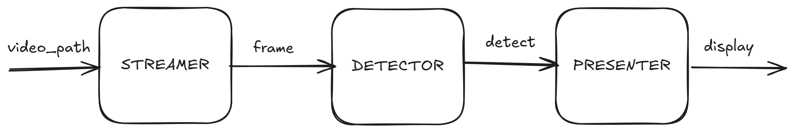
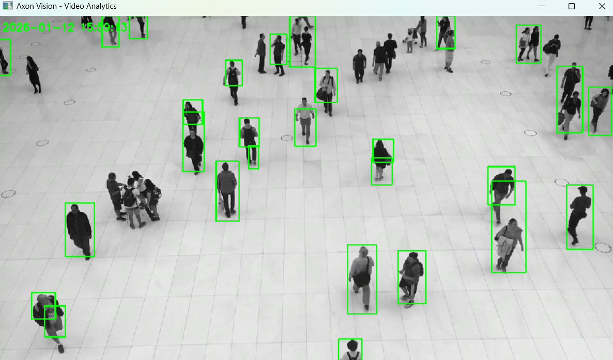
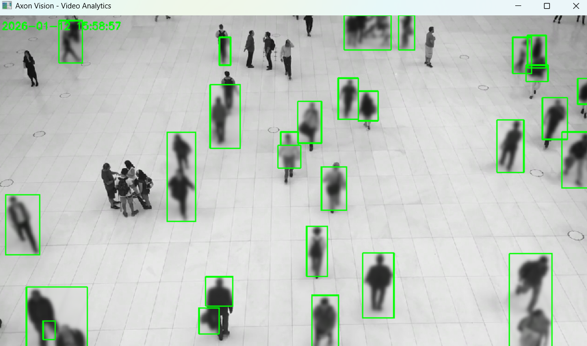

# Axon Vision - Video Analytics Pipeline

A multiprocessing video analytics pipeline with motion detection and optional blur feature.

### Flow

Video file goes to Streamer which reads frames, then Detector detects motion, finally Presenter displays results. Each process runs independently and communicates via bounded queues to prevent memory buildup.

## Architecture



## Installation

```bash
uv pip install -r requirements.txt
```

## Usage

```bash
python main.py --video path/to/video.mp4
python main.py --video path/to/video.mp4 --blur
```

## Examples

Example output on common surveillance camera data showing people walking.

**Without blur:**


**With blur:**

